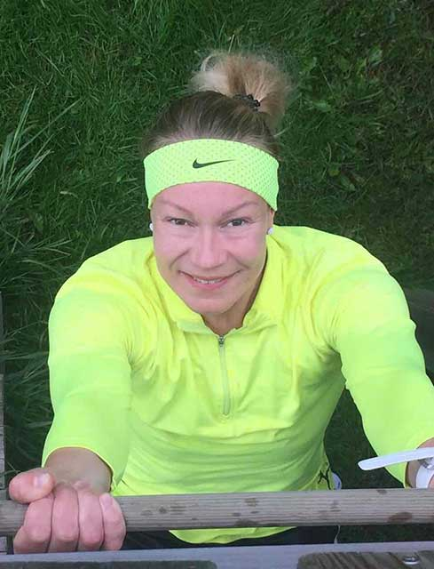

## Treeni-into hukassa?
Haluaisitko lisää tunteja vuorokauteen? Väsyttääkö? Haluaisitko jaksaa enemmän?   Elämäntapamuutos mielessä? Oletko tyytyväinen kehoosi? Onko sinulla ylipainoa? Aina nälkä tai ähky? Haluaisitko löytää treeni-innon? Lisätunteja vuorokauteen en pysty antamaan. Kaikesta muusta selviämme yhdessä.

Peruspaketti 3kk:

Alkukartoitus
Kuntotestaus, lepo VO2max, lihaskunto, liikkuvuus. 2 kpl (1projektin alussa ja 1 projektin lopussa)
12 PT-tapaamista (50min)
Kuntosaliohjelman
Kotitreeniohjelman
Harjoitussuunnitelman
Ruoka-analyysin
Kehonkoostumusmittauksen 4kpl (alkumittaus, 2 välimittausta, loppumittaus)
Puhelin- ja sähköpostituki koko valmennuksen ajan

Hinta: 249€/kk
Kevyt startti 3kk:

Alkukartoitus
6 PT-tapaamista (50min)
Kuntosaliohjelman
Harjoitussuunnitelman
Ruoka-analyysin
Kehonkoostumusmittauksen 2kpl (alkumittaus, loppumittaus)
Puhelin- ja sähköpostituki koko valmennuksen ajan

Hinta: 149€/kk
Parivalmennus 3kk:

Kaverin kanssa kuntoon!
Alkukartoitus
Kuntotestaus, lepo VO2max, lihaskunto, liikkuvuus. 2 kpl (1projektin alussa ja 1 projektin lopussa)
12 PT-tapaamista (60min)
Kuntosaliohjelman
Harjoitussuunnitelman
Ruoka-analyysin
Kehonkoostumusmittauksen 4kpl (alkumittaus, 2 välimittausta, loppumittaus)
Puhelin- ja sähköpostituki koko valmennuksen ajan

Hinta: 169€/kk/hlö
Kuntosaliohjelma

Henkilökohtainen tavoitteenmukainen saliohjelma
1 PT-tunti

Hinta: 109€

Personal Trainer

1 PT tapaaminen

Hinta: 70€

Kaksari, kaverin kanssa kuntoon

PT tapaaminen kaverin kanssa 1h 15min

Hinta: 80€

Mikäli haluat räätälöidyn tarjouksen, jotain enemmän tai vähemmän. Varaa maksuton konsultaatiotapaaminen (30 min) mietitään sinulle oikea ratkaisu.

E-mail: ansku@treeni-into.fi

Tel. 040 559 6555



### Yrityksille

Haluaisitko lisää tunteja vuorokauteen? Väsyttääkö? Haluaisitko jaksaa enemmän?   Elämäntapamuutos mielessä? Oletko tyytyväinen kehoosi? Onko sinulla ylipainoa? Aina nälkä tai ähky? Haluaisitko löytää treeni-innon? Lisätunteja vuorokauteen en pysty antamaan. Kaikesta muusta selviämme yhdessä.

```markdown

# Hinnasto
## Header 2
### Header 3

- Bulleted
- List

1. Numbered
2. List

**Bold** and _Italic_ and `Code` text

[Link](url) and 

- Ohjattu ryhmäliikuntatunti työpaikan tiloissa tai pihalla **79€/h**                 
- Ohjattu ryhmäliikuntatunti järjestämissämme tiloissa **89€/h**
- Ohjattu kovatehoinen HIIT (30min) työpaikan tiloissa **69€**
- Ohjattu kovatehoinen HIIT (30 min) järjestämissämme tiloissa **79€**
- Ohjattu ja toiveiden mukaisesti räätälöity 
toiminnallinen pihatreeni **99€**

Firman tiloissa tapahtuvien ohjausten hinnat koskee lähellä 
Kokkolan keskustaa olevia yrityksiä. Muut sopimuksen mukaan.

Jos haluat jotain mitä emme tässä hoksaneet tarjota, ole yhteydessä!

Räätälöidään vaikka teille sopiva TYKY-tunti. 


Onko työporukkasi päättänyt tempaista kilot kuriin?

Painonhallintaryhmä 5-10 hlölle.

3 kuukauden paketti 79€ (sis alv.) /hlö/kk sisältää:

-Yhteiset treenit 1x viikossa

-Omatoimitreeniohjelman

-Aktiivinen seuranta

-Kehonkoostumusmittaukset (alku ja loppu)

-Ruokapäiväkirjan analyysin, sekä neuvoja parempaan ravitsemukseen.

-Päivittäinen tuki koko projektin ajan.

```
Edellä mainitut hinnat voimassa max. 10 hengen ryhmille. Suurempien ryhmien hinnoittelu sovitaan erikseen.
```


For more details see [GitHub Flavored Markdown](https://guides.github.com/features/mastering-markdown/).

### Ravintovalmennus

RAVINTOVALMENNUS

Palvelu sisältää:

- Alkukartoituksen

- Ruokapäiväkirja-analyysin

- Esimerkkiruokavalio

- Ravintovalmennuksen sekä 2 seurantatapaamista mittauksineen

Koko projektin ajan puhelintuki/konsultaatio

Hinta: 149€

Ravintovalmennukseni tapahtuu suomalaisten ravitsemussuositusten mukaisesti. Uskon, että mikäli söisimme suositusten mukaisesti, olisimme paremmin voivia ja pysyisimme terveempinä. Mikäli käyttäisimme päivittäin puoli kiloa kasviksia ja vaihtaisimme eläinkunnan kovia rasvoja parempiin kasvikunnan tyydyttymättömiin rasvoihin, vähentäisimme liian suolan ja valkoisen sokerin saantia, niin olisimme jo pitkällä hyvän voinnin ja jaksamisen tavoittelussa

### Tietoja

Olen Kuntosalivalmentaja, Hyvinvointivalmentaja lisensoitu Personal trainer ja Ravintovalmentaja Ansku Ulvi.  Perustin Treeni-innon intohimosta liikuntaan ja halusta auttaa ihmisiä voimaan hyvin. 

Olen neljän lapsen äiti, joten tiedän miltä liikunta tuntuu raskausaikana ja sen jälkeen. Kuinka päästään takaisin huippukuntoon. Kuinka saadaan hyvinvoiva keho ja mieli. Kuinka tullaan voimakkaaksi. Pystyn auttamaan myös sinua. Haluatko?

Liikunta on näytellyt aina isoa roolia elämässäni. Minulla on monipuolinen pallopelitausta, kokemusta vesiliikunnasta extremeurheiluun. Nautin äärirajoilla olemisesta, siitä tunteesta kun ei enää jaksa. Silloin ääni sisälläni toistaa: ”jaksat kyllä”. En lopeta kun väsyttää. Lopetan kun olen valmis.

Haluan korostaa että äärirajoilla sinnittely hyvinvoinnin ja painonhallinnan näkökulmasta ei kuitenkaan ole tarpeellista, eikä edes edistä sitä.

Rakennan aina sinun henkilökohtaisten tarpeiden, toiveiden, elämäntilanteen ja tavoitteiden mukaisen suunnitelman. Minulla ei ole tarjota taika-ainetta, ihme dieettiä tai kolmen liikkeen pikapepputreeniä herätäksesi aamulla kiloja laihempana ja omistaaksesi Jennifer Lopezin muodot. Minulla on avaimet sinulle loppuelämäksi, hyvän tasapainoisen arjen löytymiseen. Keinot painon hallintaan ilman jatkuvia mielitekoja ja sortumisia. Autan sinut tavoitteeseen määrätietoisesti tavallista arkea eläen. Pysyvä elämäntaparemontti on mahdollista toteuttaa pitkällä aikavälillä,  pienin askelin ammattilaisen avulla. Ei TV-sarjojen harhaanjohtavilla pikamuuttumisleikeillä, joissa muuttuja rehkii äärirajoilla vuorokauden ympäri salaatinlehden voimalla. Jokainen kilo tulee takaisin kertoimen kera kun ohjelma on valmis.

 

Tiedän hyvän kunnon salaisuuden. Se lähtee yllättävän pienistä asioista.

Oletko valmis? Sinun ei tarvitse osata, minä opetan.
Your Pages site will use the layout and styles from the Jekyll theme you have selected in your [repository settings](https://github.com/vesaul/treeniintoweb/settings). The name of this theme is saved in the Jekyll `_config.yml` configuration file.

### Support or Contact

Having trouble with Pages? Check out our [documentation](https://docs.github.com/categories/github-pages-basics/) or [contact support](https://github.com/contact) and we’ll help you sort it out.
